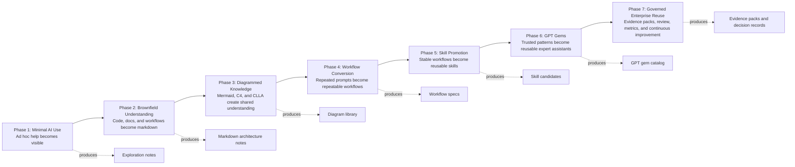

# GPT Adoption Roadmap

## Purpose

This diagram shows the actual adoption path from minimal AI usage to governed enterprise reuse.

## Operating Notes

- Treat the existing codebase and existing team process as the source of truth.
- Keep every serious AI output reviewable in markdown.
- Use diagrams to clarify decisions, not as decoration.
- Promote only proven workflows into skills and GPT gems.

