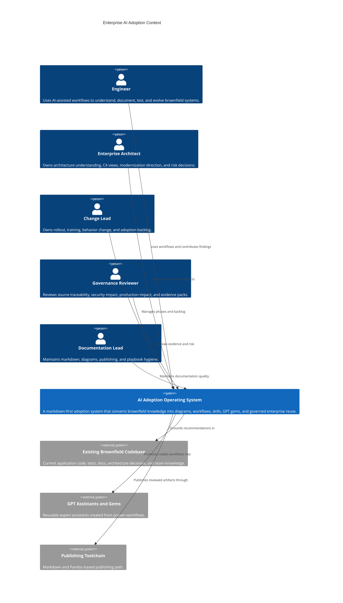

# GPT C4 Context Diagram

## Purpose

This C4 context view shows the people and systems around enterprise AI adoption.

## Review Questions

- Is every AI-assisted recommendation grounded in existing code, documentation, or explicit assumptions?
- Is the human owner clear?
- Is production-impacting work reviewed before execution?

