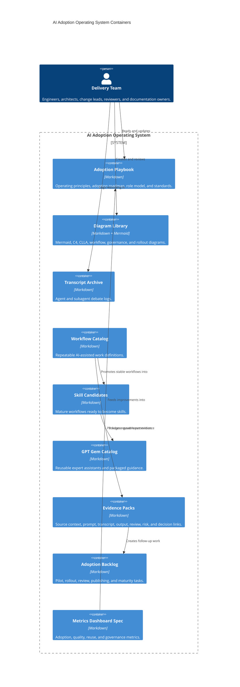

# GPT C4 Container Diagram

## Purpose

This C4 container view shows the main artifact containers in the adoption operating system.

## Container Rule

Every serious AI-assisted activity should create or update one of these containers. If it creates none, it is probably just informal experimentation.

