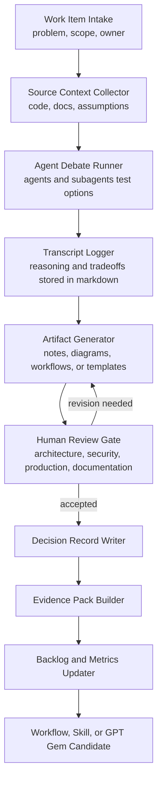

# GPT C4 Component Diagram

## Purpose

This component view shows how one AI-assisted adoption work item moves through the operating system.

## Component Responsibilities

| Component | Responsibility |
| --- | --- |
| Work Item Intake | Defines why the AI-assisted work exists |
| Source Context Collector | Prevents unsupported claims |
| Agent Debate Runner | Exposes tradeoffs before adoption |
| Transcript Logger | Preserves reasoning |
| Artifact Generator | Produces markdown-first outputs |
| Human Review Gate | Protects architecture, security, and production quality |
| Decision Record Writer | Captures accepted decisions |
| Evidence Pack Builder | Makes AI work auditable |
| Backlog and Metrics Updater | Turns learning into execution |

