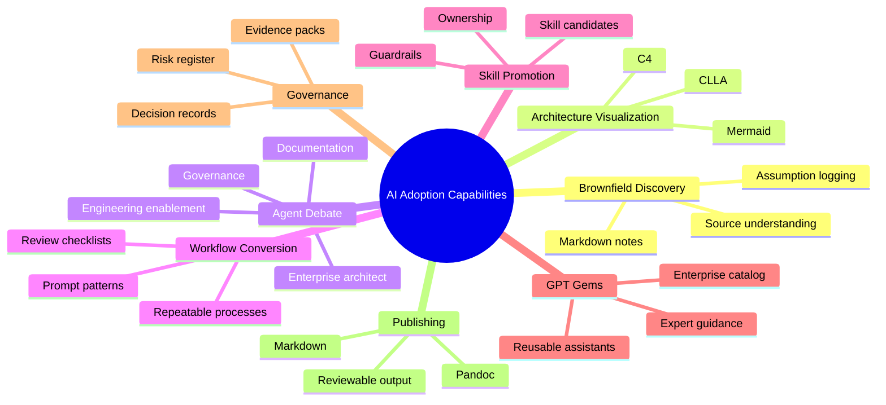
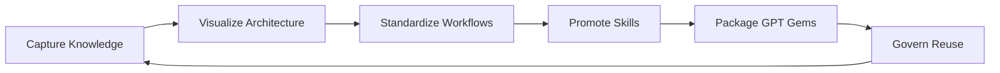
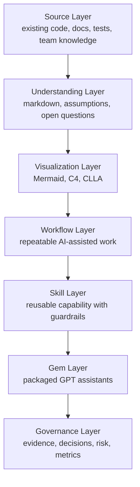
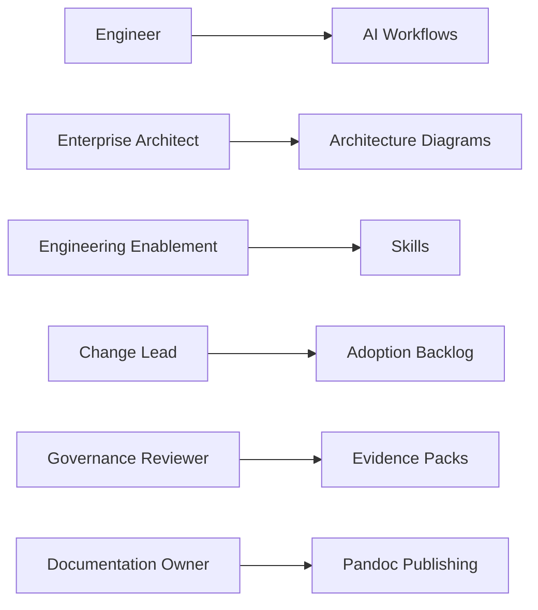

# GPT CLLA Model

CLLA is used here as Capability, Logical, Layer, and Actor views.

## Capability View

```mermaid
mindmap
  root((AI Adoption Capabilities))
    Brownfield Discovery
      Source understanding
      Markdown notes
      Assumption logging
    Architecture Visualization
      Mermaid
      C4
      CLLA
    Agent Debate
      Enterprise architect
      Engineering enablement
      Governance
      Documentation
    Workflow Conversion
      Prompt patterns
      Repeatable processes
      Review checklists
    Skill Promotion
      Skill candidates
      Guardrails
      Ownership
    GPT Gems
      Reusable assistants
      Expert guidance
      Enterprise catalog
    Governance
      Evidence packs
      Risk register
      Decision records
    Publishing
      Markdown
      Pandoc
      Reviewable output
```

## Logical View

```mermaid
flowchart LR
  A["Capture Knowledge"] --> B["Visualize Architecture"]
  B --> C["Standardize Workflows"]
  C --> D["Promote Skills"]
  D --> E["Package GPT Gems"]
  E --> F["Govern Reuse"]
  F --> A
```

## Layer View

```mermaid
flowchart TB
  L1["Source Layer<br/>existing code, docs, tests, team knowledge"] --> L2["Understanding Layer<br/>markdown, assumptions, open questions"]
  L2 --> L3["Visualization Layer<br/>Mermaid, C4, CLLA"]
  L3 --> L4["Workflow Layer<br/>repeatable AI-assisted work"]
  L4 --> L5["Skill Layer<br/>reusable capability with guardrails"]
  L5 --> L6["Gem Layer<br/>packaged GPT assistants"]
  L6 --> L7["Governance Layer<br/>evidence, decisions, risk, metrics"]
```

## Actor View

```mermaid
flowchart LR
  Engineer["Engineer"] --> Workflows["AI Workflows"]
  Architect["Enterprise Architect"] --> Diagrams["Architecture Diagrams"]
  Enablement["Engineering Enablement"] --> Skills["Skills"]
  ChangeLead["Change Lead"] --> Backlog["Adoption Backlog"]
  Governance["Governance Reviewer"] --> Evidence["Evidence Packs"]
  Documentation["Documentation Owner"] --> Publishing["Pandoc Publishing"]
```

