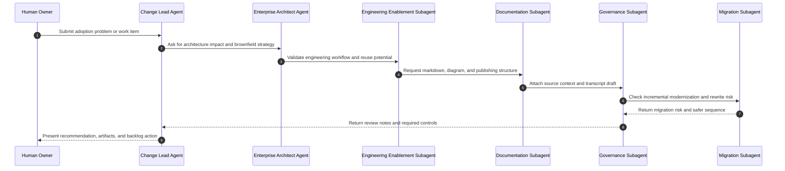

# GPT Agent and Subagent Operating Model

## Purpose

This diagram defines how agents and subagents collaborate during actual adoption work.

## Role Contract

| Role | Must Produce | Must Avoid |
| --- | --- | --- |
| Change Lead Agent | Phase plan, backlog item, adoption decision | Tool-only thinking |
| Enterprise Architect Agent | C4/CLLA impact, modernization guidance | Rewrite-first assumptions |
| Engineering Enablement Subagent | Workflow and skill candidates | One-off prompt dependency |
| Documentation Subagent | Markdown and diagram hygiene | Unreviewable outputs |
| Governance Subagent | Evidence, risk, review checklist | Untraceable approvals |
| Migration Subagent | Incremental path and test discovery | Big-bang modernization |

