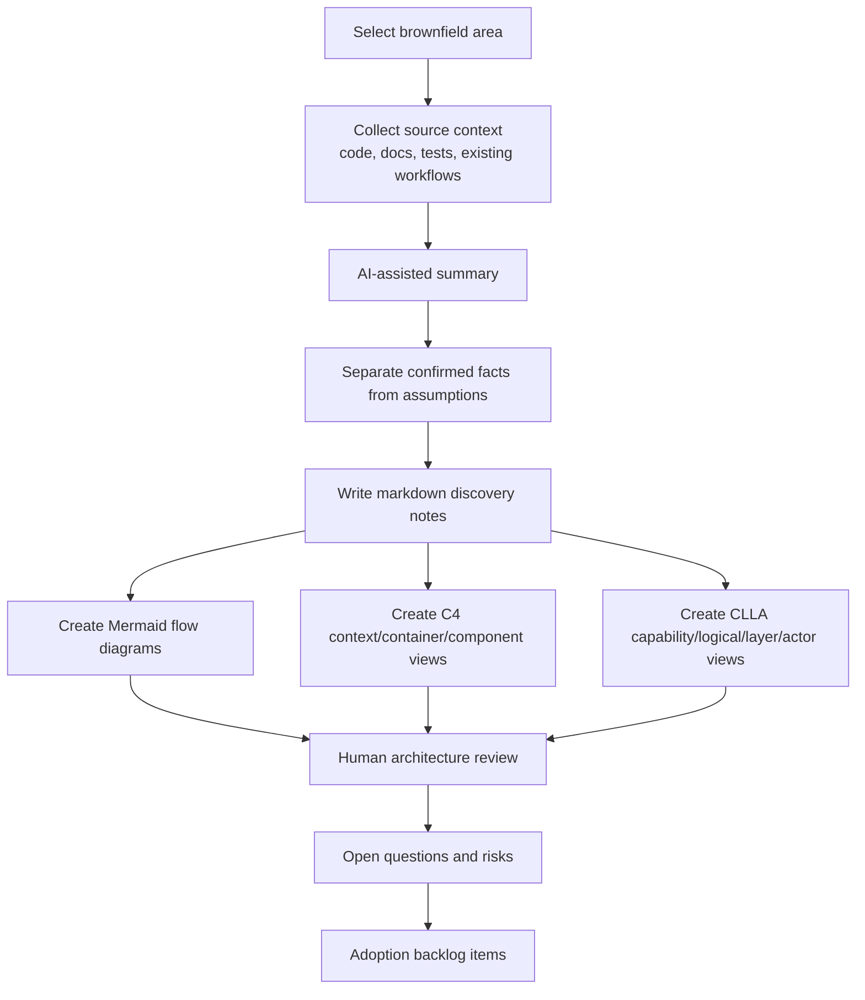

# GPT Brownfield Discovery Flow

## Purpose

This diagram shows how an existing codebase becomes adoption-ready knowledge.

## Discovery Output Checklist

- Markdown notes exist.
- Assumptions are marked.
- Diagrams answer specific questions.
- Agent transcript is linked.
- Risks are registered.
- Follow-up work is added to the backlog.

