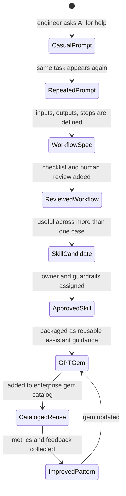

# GPT Workflow to Skill to Gem

## Purpose

This diagram shows the promotion path from informal prompting to reusable enterprise AI capability.

## Promotion Gates

| Gate | Question |
| --- | --- |
| Prompt to Workflow | Has this task repeated enough to standardize? |
| Workflow to Skill | Are inputs, outputs, steps, and review points stable? |
| Skill to GPT Gem | Is the practice trusted enough for broad reuse? |
| GPT Gem to Catalog | Is there an owner, guardrail, and maintenance rule? |

