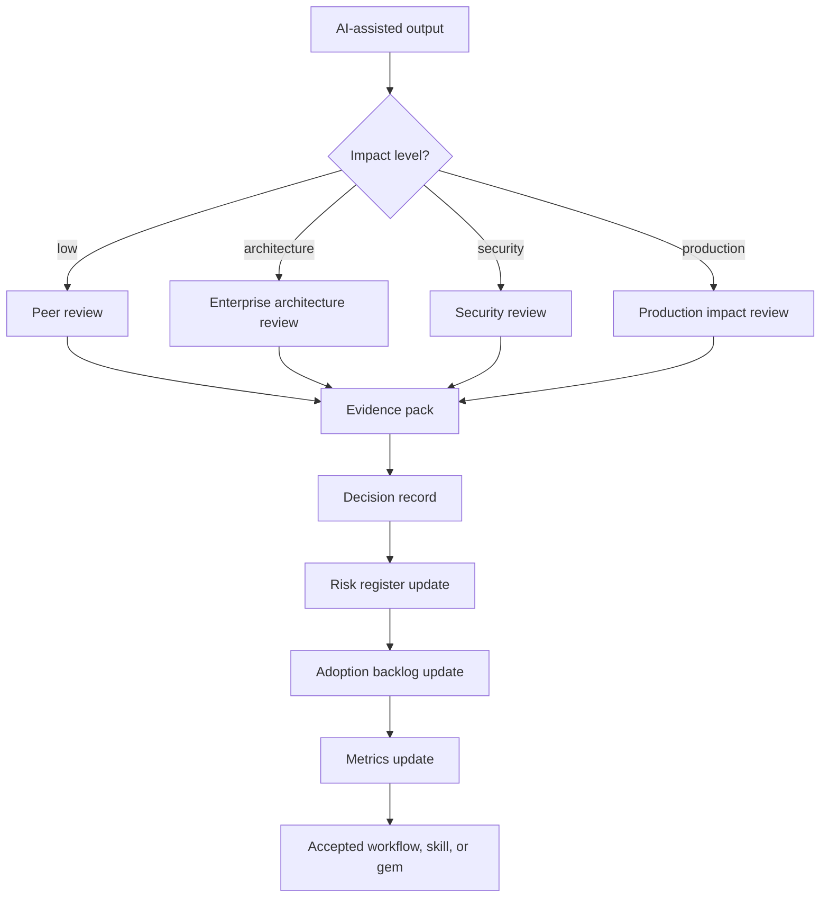
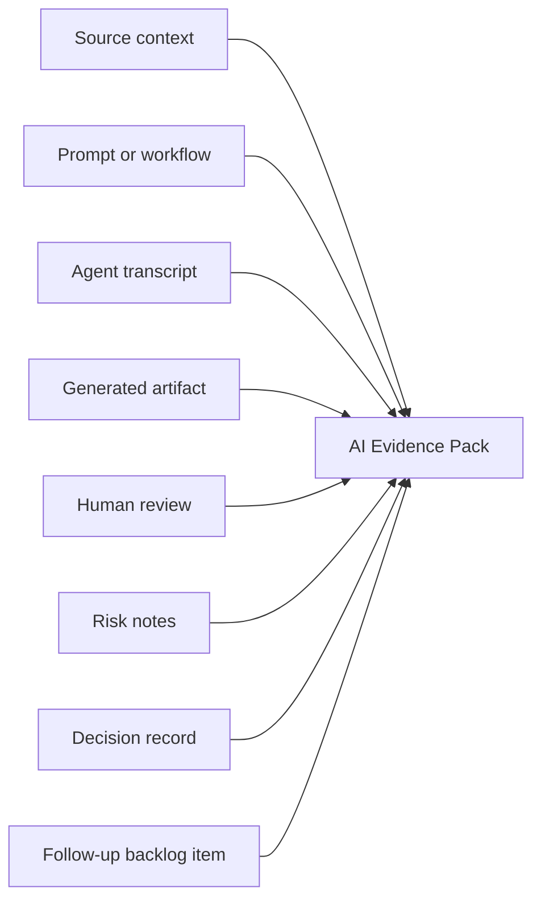

# GPT Governance and Evidence Flow

## Purpose

This diagram shows how serious AI-assisted work becomes reviewable and auditable.

## Evidence Pack Contents

## Governance Rule

Any AI output that influences architecture, migration, security, or production code must have an evidence pack.

