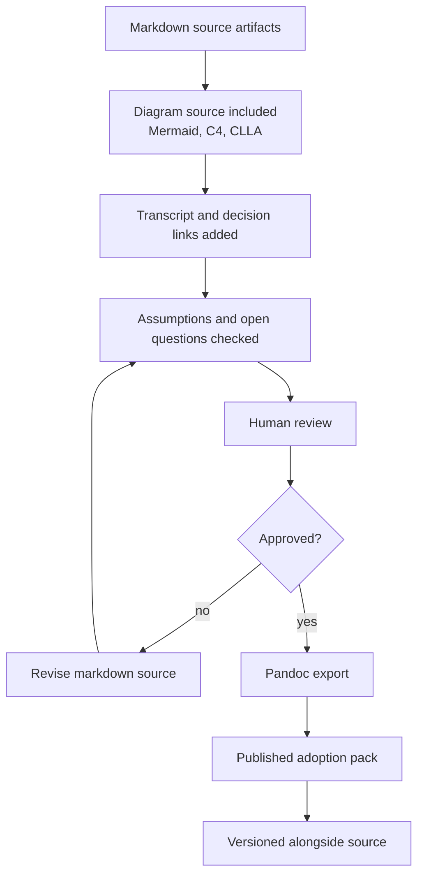

# GPT Pandoc Publishing Flow

## Purpose

This diagram shows how markdown adoption artifacts become polished, shareable documents without losing source traceability.

## Publishing Inputs

- Adoption playbook
- Diagram markdown
- Agent transcript logs
- Workflow specs
- Skill and GPT gem catalogs
- Governance checklist
- Risk register
- Evidence packs
- Decision records

