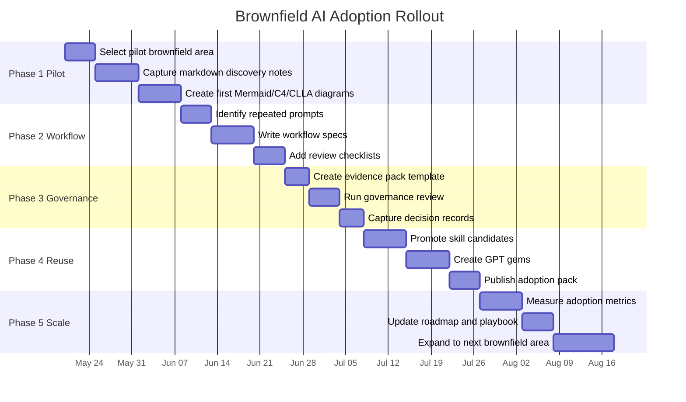

# GPT Rollout Timeline

## Purpose

This diagram shows a practical adoption rollout from pilot to enterprise reuse.

## Timeline Rule

The dates are placeholders. Keep the sequence, but adjust the schedule to team capacity.

