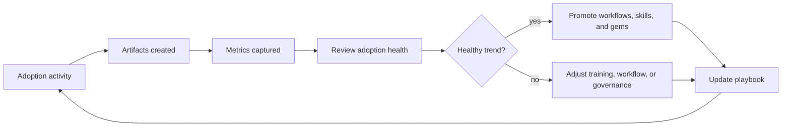

# GPT Metrics Feedback Loop

## Purpose

This diagram shows how adoption metrics improve the operating model.

## Metrics

| Metric | Adoption Signal |
| --- | --- |
| Markdown artifacts created | Knowledge is being captured |
| Diagrams reviewed | Architecture understanding is shared |
| Agent transcripts logged | Reasoning is preserved |
| Workflows created | Prompting is becoming repeatable |
| Skills promoted | Reuse is becoming practical |
| GPT gems cataloged | Enterprise guidance is emerging |
| Evidence packs completed | Governance is keeping pace |
| Decision records created | Choices are explicit |

## Feedback Rule

Metrics are useful only if they change behavior. Review them at the end of each adoption phase.

