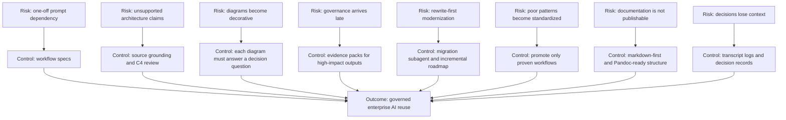

# GPT Risk Control Map

## Purpose

This diagram maps common AI adoption risks to controls.

## Control Checklist

- Does every high-impact output have source context?
- Does every major recommendation have a transcript?
- Does every accepted decision have a decision record?
- Does every repeated prompt have a workflow candidate?
- Does every mature workflow have an owner before becoming a skill or gem?

