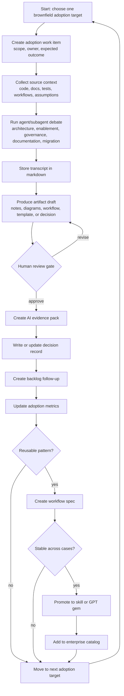

# GPT Actual Adoption Execution Map

## Purpose

This is the operating map for running actual adoption work on a brownfield project.

## Definition of Done

An adoption work item is done only when:

- Source context or assumptions are recorded.
- Agent reasoning is logged.
- The artifact is markdown-first or reviewable.
- Human review is complete.
- Risks and decisions are captured.
- Follow-up work is visible.
- Reusable patterns are promoted only after they prove stable.

