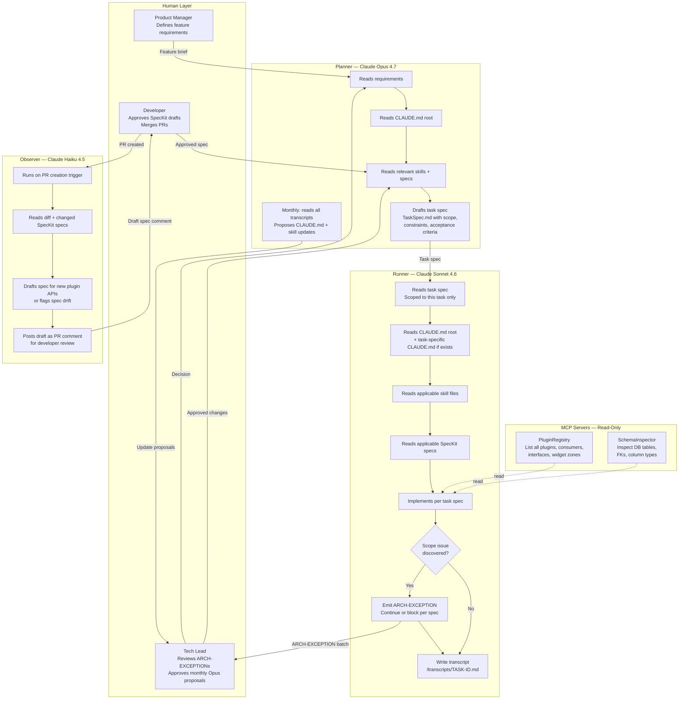
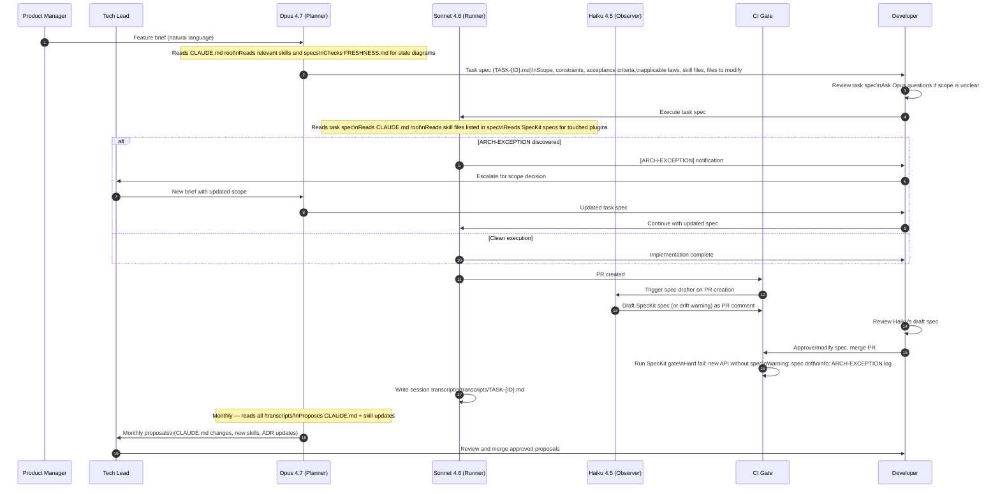
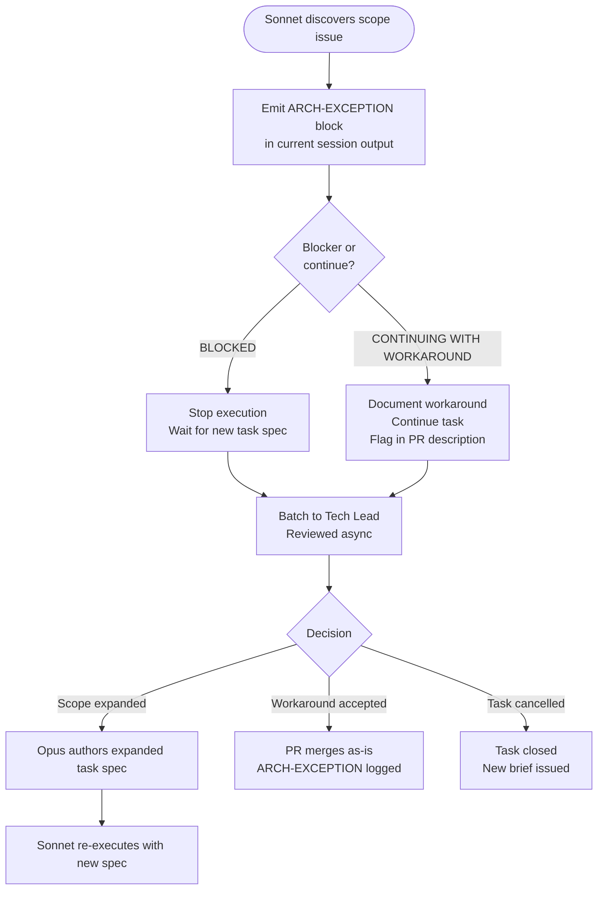

# Multi-Agent Orchestration Diagram

**Target path in repo**: `/docs/architecture/agent-workflow.md`  
**Owner**: @arch-lead  
**Status**: CURRENT  
**Verified**: 2026-05-16  
**Next review due**: 2026-08-16

---

## Planner / Runner / Observer Model



---

## Feature Cycle Sequence



---

## ARCH-EXCEPTION Protocol



An `[ARCH-EXCEPTION]` block looks like:

```
[ARCH-EXCEPTION]
Task: TASK-20260516-042
Issue: Adding loyalty points requires reading LoyaltyPlugin settings, but the existing
       LoyaltyPluginSettings class does not have a PointsEnabled flag — all orders
       get points unconditionally. Product requirement implies a toggle is needed.
Impact: Need a new setting + admin UI, which is explicitly out of scope for this task.
Recommendation: Either (a) expand scope to include setting + UI, or (b) implement
                unconditional points award for now and track UI as a follow-up task.
Status: CONTINUING WITH WORKAROUND — implemented unconditional points award.
        Created follow-up issue #234 for the toggle UI.
```

---

## Agent Roles and Model Assignments

| Role | Model | When Used | Context Loaded |
|---|---|---|---|
| **Planner** | Claude Opus 4.7 | Feature planning, task spec authoring, monthly review | CLAUDE.md root + all skills + all specs + recent transcripts |
| **Runner** | Claude Sonnet 4.6 | Task execution per spec | CLAUDE.md root + task-specific CLAUDE.md + skill files listed in spec + SpecKit spec for touched plugin |
| **Observer (spec-drafter)** | Claude Haiku 4.5 | Triggered on PR creation | PR diff + changed SpecKit specs + plugin-event-consumer skill |
| **Discovery** | Claude Opus 4.7 | Bi-annual codebase discovery run | Full codebase scan — no prior context loaded |
| **Diagram verifier** | Claude Sonnet 4.6 | Architecture diagram re-verification | Single diagram file + relevant source files |

---

## MCP Server Specifications (Read-Only)

### PluginRegistry MCP

Exposes the plugin registry — all loaded plugins, their consumers, widget zones, and interfaces.

```
Tool: list_plugins
Returns: [{SystemName, FolderName, Version, IsActive, Assembly}]

Tool: get_plugin_consumers(plugin_system_name)
Returns: [{EventType, HandlerClass, Priority, OrderAttribute}]

Tool: get_plugin_widget_zones(plugin_system_name)
Returns: [{ZoneName, ViewComponentName}]

Tool: get_event_consumers(event_type)
Returns: [{PluginSystemName, HandlerClass, Priority}] sorted by execution order
```

### SchemaInspector MCP

Exposes the SQL Server schema — tables, columns, foreign keys, indexes.

```
Tool: inspect_table(table_name)
Returns: {TableName, Columns:[{Name, Type, Nullable, DefaultValue}], FKs, Indexes}

Tool: find_tables_by_column(column_name)
Returns: [{TableName, ColumnName, ColumnType}]

Tool: get_migration_history()
Returns: [{MigrationId, AppliedOn}]
```

**Write capabilities**: Not exposed via MCP. All writes go through `IRepository<T>` in application code, not via MCP server tooling. This prevents AI-authored SQL from bypassing cache invalidation and soft-delete filters (LAW-5).

---

## Transcript Format

All Sonnet execution sessions produce a transcript at `/transcripts/TASK-{ID}.md`:

```markdown
# Session Transcript — TASK-{ID}

**Task**: {task title}
**Date**: {YYYY-MM-DD}
**Model**: claude-sonnet-4-6
**Duration**: {minutes}

## Context Loaded
- CLAUDE.md root (LAW-1 through LAW-6)
- Skills: {list}
- Specs: {list}

## Execution Summary
{3-5 sentences: what was done, in what order, any decisions made}

## ARCH-EXCEPTIONs
{None / or list with status}

## Files Modified
{list with change summary}

## Laws Applied
{Which laws were relevant and how they were applied}

## Open Questions
{Any ambiguity encountered that was resolved by assumption — for Opus monthly review}
```
