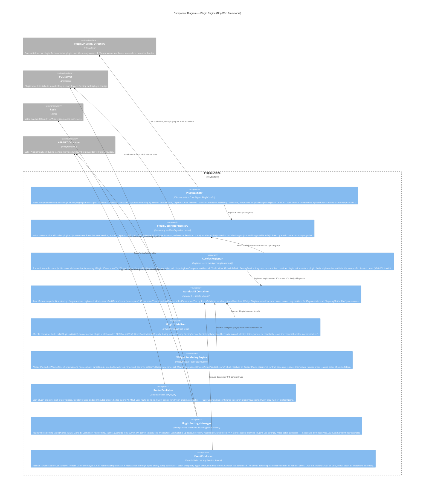
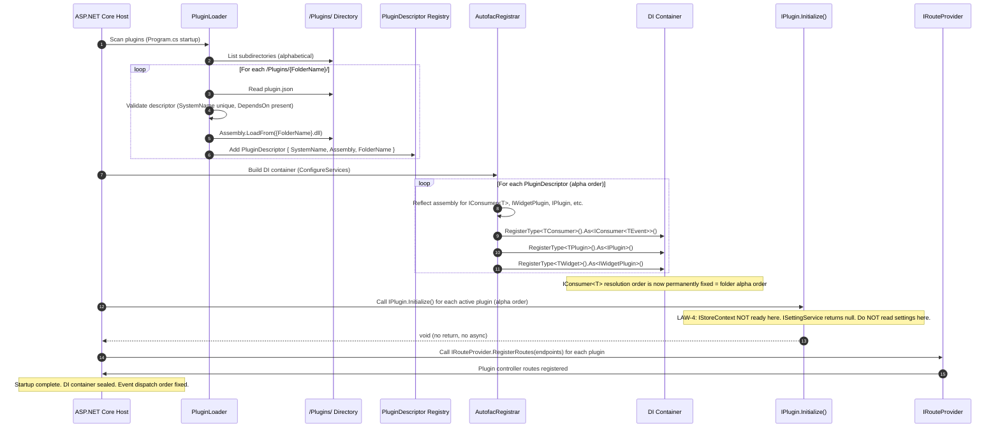

# C4 Component Diagram — Plugin Engine Internals

**Target path in repo**: `/docs/architecture/component-plugins.md`  
**Verified**: 2026-05-16 by @arch-lead (against ILSpy decompilation of Nop.Web.Framework + Autofac registration logs)  
**Status**: CURRENT  
**Next review due**: 2026-08-16  
**Source**: Discovery run 2026-05-16 — manual trace through plugin bootstrap sequence

---

## Plugin Engine Component Diagram



---

## Plugin Startup Sequence



---

## Plugin Folder Naming Convention

```
/Plugins/
  Nop.Plugin.A_EmailQueue/          ← Sorts first — handles email in event dispatch
  Nop.Plugin.Auth.AzureAD/          ← Azure AD SSO
  Nop.Plugin.Catalog.Inventory/     ← Stock management consumer
  Nop.Plugin.Integration.ERP/       ← ERP sync
  Nop.Plugin.Search.Elasticsearch/  ← Search indexing consumer
  Nop.Plugin.Tax.Avalara/           ← Avalara tax integration
  Nop.Plugin.Z_ERPIntegration/      ← Sorts last — runs after all other event consumers
```

**Governance rule (ADR-001)**: Plugins with ordering dependencies MUST use `[EventHandlerOrder(int)]` attribute AND prefix their folder with `A_` (first) or `Z_` (last). Unprefixed plugins execute in alpha position between `A_*` and `Z_*`.

---

## Critical Load Order Incidents

| Incident | Folder Change | Effect | Resolution |
|---|---|---|---|
| 2025-Q2: Missing ERP sync | `Nop.Plugin.Z_ERPIntegration` renamed to `Nop.Plugin.ERPIntegration` | Ran before EmailQueue — business logic assumed it ran last | Restored `Z_` prefix; ADR-001 written |
| 2024-Q4: Widget rendered twice | New plugin folder `Nop.Plugin.AAAWidget` inserted before `Nop.Plugin.A_EmailQueue` | Widget zone rendered same zone from both plugins | Renamed to `Nop.Plugin.Widgets.AAA` |
| 2025-Q1: Settings null on startup | Plugin read `ISettingService` in `Initialize()` | Returned null, caused NullReferenceException on first request | LAW-4 documented; settings moved to first request |
