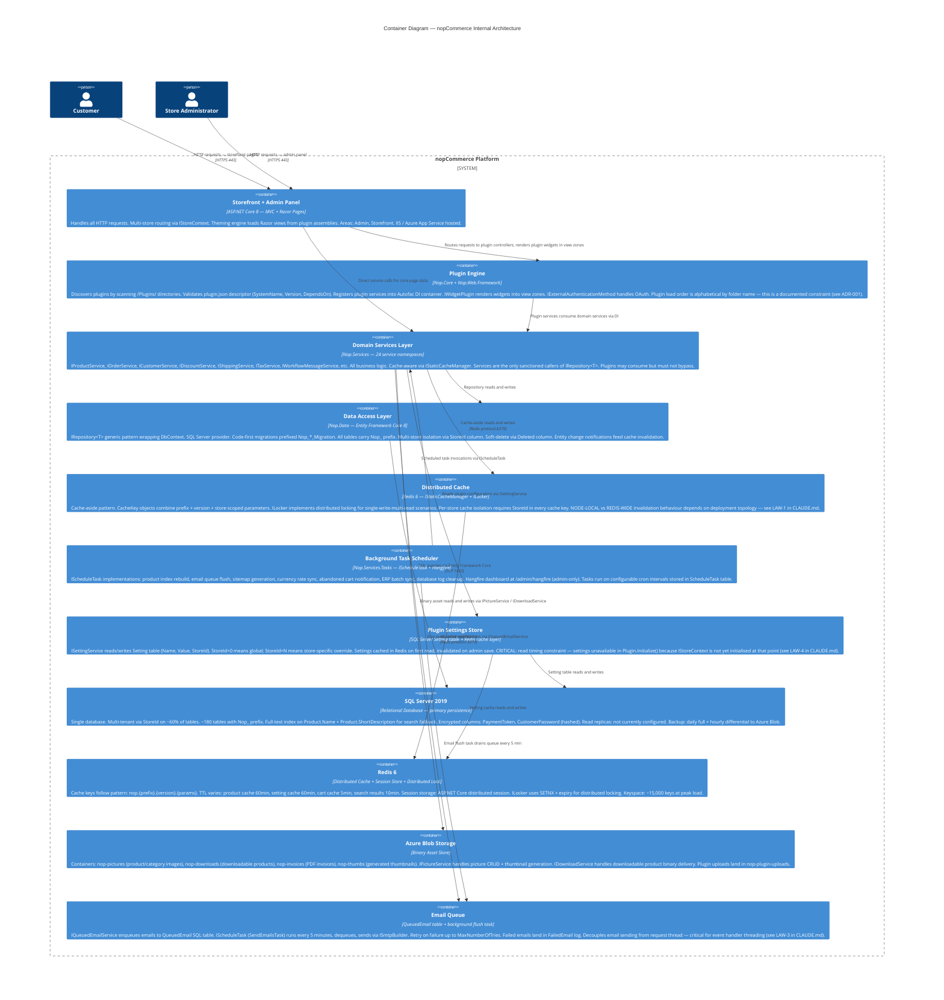

# C4 Container Diagram — nopCommerce Internal Architecture

**Target path in repo**: `/docs/architecture/container.md`  
**Verified**: 2026-05-16 by @arch-lead  
**Status**: CURRENT  
**Next review due**: 2026-08-16  
**Source**: Discovery run + manual verification against IIS configuration and Redis keyspace scan

---

## Container Diagram



---

## Critical Constraints (sourced from incident history)

### Cache Isolation (LAW-1)
`IStaticCacheManager.RemoveByPrefix()` behaviour differs by deployment:
- **Single-server**: removes from in-memory cache only (this node)
- **Multi-server (Redis)**: removes cluster-wide

Always assume multi-server. Use `RemoveAsync(specificKey)` for targeted invalidation. Never assume a prefix sweep is safe without confirming deployment topology.

### Settings Read Timing (LAW-4)
Plugin `Initialize()` is called during app startup **before** `IStoreContext` is initialised. Any `ISettingService.GetSettingByKey()` call in `Initialize()` returns `null` silently — no exception. Settings must be read lazily (first request handler) or via constructor injection after startup completes.

### Plugin Load Order
Plugins load alphabetically by folder name (`/Plugins/Nop.Plugin.A/` before `/Plugins/Nop.Plugin.B/`). This affects:
- DI registration order
- `IConsumer<T>` event handler execution order
- Widget rendering order when multiple plugins target the same zone

See ADR-001 for the formal decision on making this order explicit via `[EventHandlerOrder]` attribute.

---

## Deployment Topology (current)

```
Azure App Service Plan (P2v3)
  └─ 2 instances (auto-scale 2–4 on CPU >70%)
  └─ Shared Redis (Azure Cache for Redis — Standard C2)
  └─ SQL Server (Azure SQL Database — Business Critical tier)
  └─ Azure Blob Storage (LRS, hot tier)
  └─ Application Insights workspace
```

The 2-instance deployment means **all cache invalidation must assume multi-server**. This is LAW-1. Any single-server assumption will work in local development and fail silently in production.
