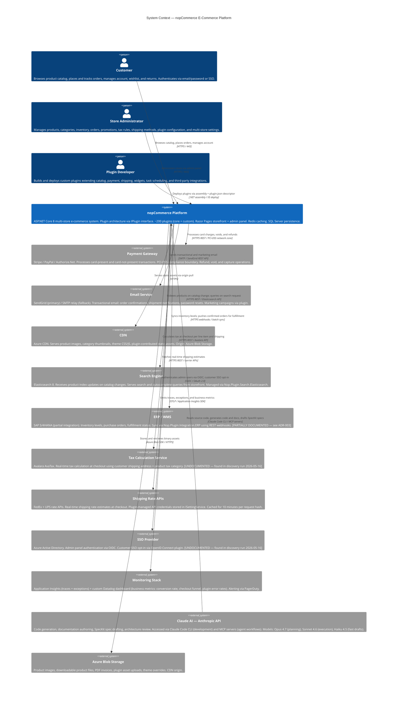

# C4 Context Diagram — nopCommerce Platform

**Target path in repo**: `/docs/architecture/context.md`  
**Verified**: 2026-05-16 by @arch-lead (against staging + production topology)  
**Status**: CURRENT  
**Next review due**: 2026-08-16  
**Source**: Generated from Claude Code discovery run on `/src`, verified against runtime HTTP traces

---

## System Context

---

## Discovery Notes (2026-05-16)

The following external systems were **not in the team's mental model** before the discovery run. They were found by scanning all `HttpClient` usages and external endpoint configurations in `/src`:

| System | Found in | Notes |
|---|---|---|
| Avalara AvaTax | `Nop.Plugin.Tax.Avalara/Services/AvaTaxManager.cs` | Called on every checkout. Timeout fallback uses estimated rate. |
| Azure AD SSO | `Nop.Plugin.Auth.AzureAD/Controllers/AuthController.cs` | Admin-only. Customers use local auth + optional OpenID plugin. |

Both are now included in this diagram and have been added to `FRESHNESS.md`.

---

## Boundary Clarifications

- **PCI-DSS boundary**: Payment Gateway is outside nopCommerce. No raw card data enters the platform. Only tokenized references from Stripe/PayPal SDK.
- **Claude AI boundary**: Claude reads code at development time and via MCP servers during agent workflows. Claude does **not** run in the production request path.
- **ERP sync is async**: Order push to ERP happens via a background `IScheduleTask`, not synchronously at order placement.
