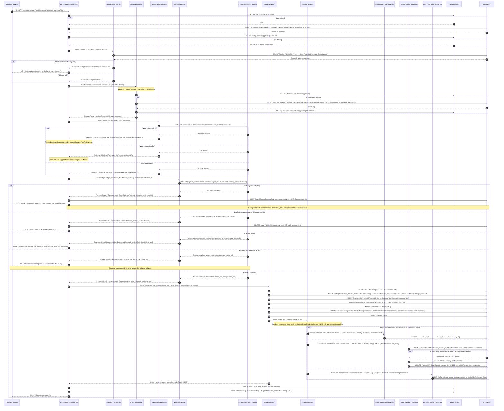

# Sequence Diagram — Checkout Flow (Complete with Error Paths)

**Target path in repo**: `/docs/architecture/sequence-checkout.md`  
**Verified**: 2026-05-16 by @senior-dev-1 (against staging trace captures + payment gateway sandbox logs)  
**Status**: CURRENT  
**Next review due**: 2026-08-16  
**Covers**: Full checkout — cart validation, discount application, tax calculation, payment processing, order placement, event fan-out, and all documented error paths

---

## Full Checkout Sequence

---

## Error Path Summary

| Scenario | Response | Order State | Recovery |
|---|---|---|---|
| Gateway timeout | `/checkout/pending` page | `PendingPayment` + IdempotencyKey stored | Background retry every 5min × 6; then `OrderFailed` |
| Duplicate charge | Redirect to existing order | Order already exists | Idempotency key lookup — no new order |
| Card declined | Checkout page with decline message | No order created | Customer re-enters payment method |
| 3DS required | 3DS UI shown (Stripe.js) | `PendingAuthentication` | Customer completes 3DS; webhook triggers order placement |
| Avalara timeout | Proceed with fallback tax rate | `RequiresTaxReview=true` | Finance team manually reviews within 24h |
| Stock conflict (race) | InventoryPlugin retries optimistic concurrency | Order placed; stock updated after retry | Automatic retry — no user impact |
| Cart cache miss | Reload from DB transparently | No order state yet | Transparent to user — adds latency only |

---

## Critical Constraints in This Flow

**LAW-1 (Cache scope)**: Cart invalidation uses `RemoveAsync(specificKey)`, not `RemoveByPrefixAsync`. Product stock key invalidation targets specific product keys, not a broad prefix sweep.

**LAW-3 (Event handler threading)**: All `IConsumer<OrderPlacedEvent>` handlers are `void HandleEvent(...)` — no `async/await`. Email enqueuing calls `IQueuedEmailService.InsertQueuedEmail()` synchronously (it only inserts to DB, does not send).

**LAW-6 (Stock concurrency)**: Both `IOrderService.PlaceOrder()` and `InventoryPlugin.HandleEvent()` write `Product.StockQuantity`. Optimistic concurrency via `RowVersion` with retry handles the race. The `SERIALIZABLE` transaction in `PlaceOrder` prevents double-sell at the order level; the consumer retry handles post-event consistency.

**Idempotency key**: Generated as `Guid.NewGuid()` per checkout session, stored in user session. On timeout, the key is persisted with the pending order and reused on retry. Stripe's idempotency key prevents double-charging.
