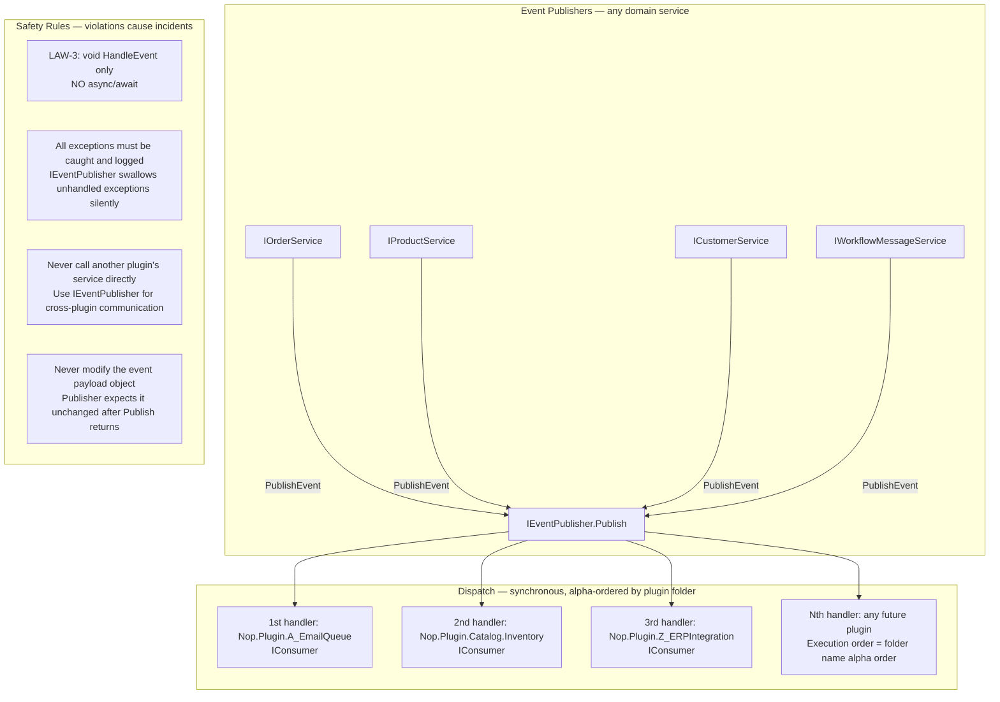
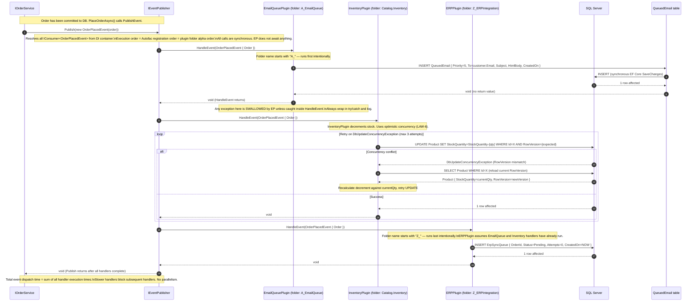

# Sequence Diagram — Plugin Event System (IEventPublisher / IConsumer)

**Target path in repo**: `/docs/architecture/sequence-plugin-events.md`  
**Verified**: 2026-05-16 by @arch-lead + @senior-dev-2 (via ILSpy reflection of plugin assemblies)  
**Status**: CURRENT  
**Next review due**: 2026-08-16  
**Critical reading**: Anyone adding a new `IConsumer<T>` handler MUST read this document first

---

## Plugin Event System Architecture



---

## OrderPlacedEvent — Full Dispatch Sequence



---

## Event Catalogue (nopCommerce Core + Custom)

| Event Type | Published by | Registered Consumers (in execution order) | Notes |
|---|---|---|---|
| `OrderPlacedEvent` | IOrderService | EmailQueuePlugin → InventoryPlugin → ERPPlugin | 3 consumers. Stock write race documented in LAW-6. |
| `OrderPaidEvent` | IOrderService | EmailQueuePlugin (payment confirmation) → ERPPlugin (fulfillment trigger) | 2 consumers. |
| `OrderRefundedEvent` | IOrderService | EmailQueuePlugin (refund confirmation) → InventoryPlugin (stock restore) → ERPPlugin | 3 consumers. Stock restore must be idempotent. |
| `EntityInserted<Product>` | IProductService | SearchIndexPlugin (Elasticsearch indexer) | 1 consumer. Async-safe: uses Fire-and-forget pattern via IBackgroundTaskQueue. Exception here = search index lag, not data loss. |
| `EntityUpdated<Product>` | IProductService | SearchIndexPlugin | Same as above. |
| `CustomerRegisteredEvent` | ICustomerService | EmailQueuePlugin (welcome email) → LoyaltyPlugin (points init) | 2 consumers. |
| `CustomerLoggedInEvent` | ICustomerService | SecurityAuditPlugin | 1 consumer. Must complete in <10ms — login page latency. |

---

## Handler Implementation Contract

Every `IConsumer<T>` implementation MUST follow this pattern exactly:

```csharp
// COMPLIANT handler pattern
public class MyEventConsumer : IConsumer<OrderPlacedEvent>
{
    private readonly IMyService _myService;
    private readonly ILogger<MyEventConsumer> _logger;

    public MyEventConsumer(IMyService myService, ILogger<MyEventConsumer> logger)
    {
        _myService = myService;
        _logger = logger;
    }

    // RULE 1: void return type — NEVER async Task
    public void HandleEvent(OrderPlacedEvent eventMessage)
    {
        // RULE 2: Wrap entire body in try/catch — EP swallows unhandled exceptions silently
        try
        {
            var order = eventMessage.Order;

            // RULE 3: Only synchronous work or synchronous enqueueing of async work
            // OK: synchronous DB write
            _myService.RecordOrderProcessed(order.Id);

            // OK: enqueue for background processing
            // _backgroundTaskQueue.Enqueue(() => SlowAsyncWork(order.Id));

            // NEVER: await SlowAsyncWork(order.Id) — thread pool starvation under load
            // NEVER: Task.Run(() => SlowAsyncWork(order.Id)).Wait() — same problem
        }
        catch (Exception ex)
        {
            // RULE 4: Log the exception — without this, failures are invisible
            _logger.LogError(ex, "Failed handling OrderPlacedEvent for order {OrderId}",
                eventMessage.Order.Id);
            // Do NOT rethrow — EP will swallow it anyway, but rethrowing breaks other handlers
        }
    }
}
```

---

## Execution Order Governance

Plugin event handlers execute in **Autofac DI registration order**, which is **plugin folder alphabetical order**.

This is non-obvious and was discovered during the P0 discovery run as a load-bearing undocumented constraint. Three incidents occurred because:
1. A plugin was renamed, changing its alphabetical position
2. A new plugin was added with a folder name that inserted it between two order-dependent handlers
3. A plugin assumed it ran last (because its business logic required all prior handlers to complete)

**Governance rule (from ADR-001)**: All plugins with ordering dependencies MUST declare this via `[EventHandlerOrder(int priority)]` attribute. Undecorated handlers default to alphabetical. Decorated handlers take precedence. See ADR-001 for full decision record.

---

## Known Incident History (event system)

| Incident | Root Cause | Resolution |
|---|---|---|
| 2024-Q3: Double stock decrement | InventoryPlugin + OrderService both decremented without concurrency check | LAW-6: optimistic concurrency + retry |
| 2025-Q1: Thread pool starvation at checkout peak | Plugin added `async Task HandleEvent` — 300ms async operation × 100 concurrent | LAW-3: sync-only handlers, async work goes to queue |
| 2025-Q2: Missing ERP sync for 48 orders | ERPPlugin renamed folder — ran before EmailPlugin, which expected to run last | ADR-001: EventHandlerOrder attribute introduced |
| 2025-Q4: Silent email queue backlog | Exception in EmailQueuePlugin swallowed by EP, no log written | Required: try/catch + ILogger in all handlers |
