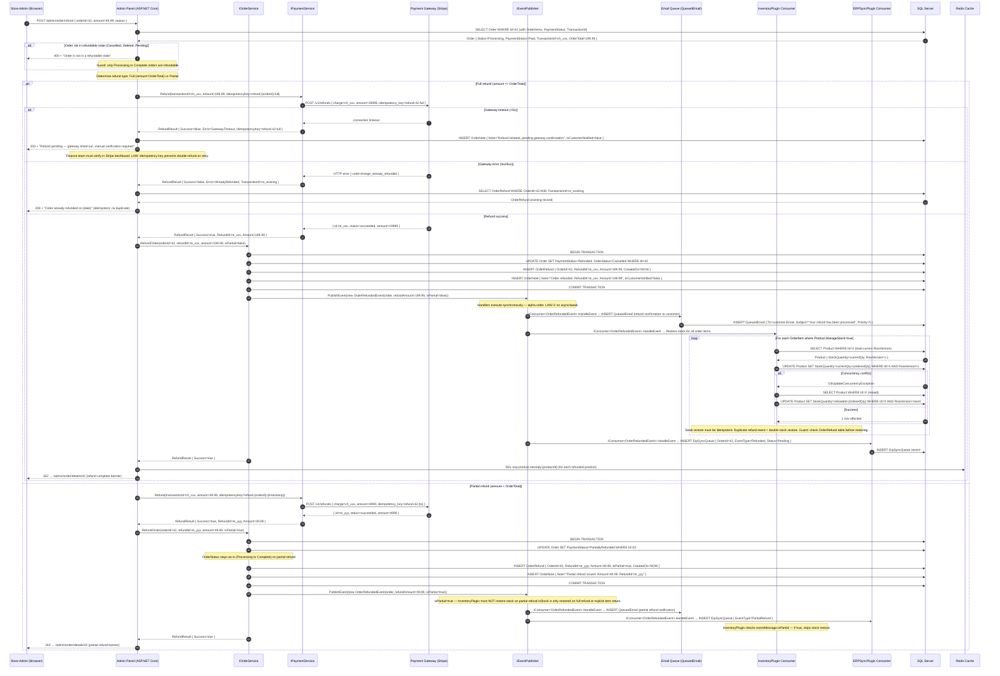
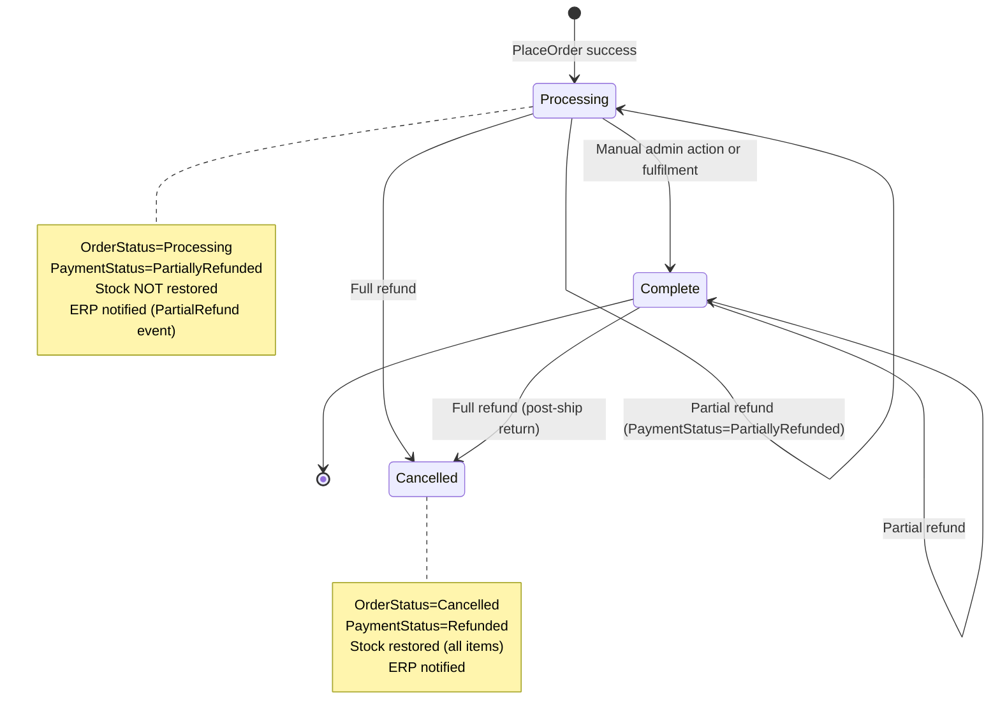

# Sequence Diagram — Order Refund Flow (with Stock Restore)

**Target path in repo**: `/docs/architecture/sequence-refund.md`  
**Verified**: 2026-05-16 by @senior-dev-1 (against payment gateway sandbox + staging trace captures)  
**Status**: CURRENT  
**Next review due**: 2026-08-16  
**Covers**: Full refund path — partial and full refund, payment gateway void/refund, stock restore, ERP notification, idempotency

---

## Full Refund Sequence



---

## Refund State Machine



---

## Idempotency Rules

| Scenario | Idempotency Key Pattern | Guard |
|---|---|---|
| Full refund | `refund-{orderId}-full` | Stripe rejects duplicate, nop checks `OrderRefund` table |
| Partial refund | `refund-{orderId}-{unixTimestamp}` | Admin must not re-submit — no auto-retry |
| Gateway timeout retry | Same key as original attempt | Stripe returns existing refund, nop checks `OrderRefund` |
| Already-refunded response | N/A — Stripe returns existing refund ID | Look up `OrderRefund WHERE TransactionId=re_existing`, surface to admin |

---

## Stock Restore Rules (InventoryPlugin)

```
IF OrderRefundedEvent.IsPartial == true
    → Skip stock restore (partial refunds do not return items)
IF OrderRefundedEvent.IsPartial == false
    → Restore StockQuantity for all OrderItems where Product.ManageStock == true
    → Use optimistic concurrency (RowVersion) with retry (max 3)
    → Guard: SELECT OrderRefund WHERE OrderId=X AND EventType=Refunded before restoring
      If record exists AND stock already restored → skip (idempotency for duplicate events)
```

---

## Known Incident History (refund flow)

| Incident | Root Cause | Resolution |
|---|---|---|
| 2025-Q1: Double stock restore | InventoryPlugin lacked idempotency guard — admin re-clicked refund on timeout | Check `OrderRefund` table before restoring; idempotency key on Stripe call |
| 2025-Q3: Partial refund restored stock | InventoryPlugin did not check `IsPartial` flag | Added `if (eventMessage.IsPartial) return;` guard in InventoryPlugin |
| 2024-Q4: ERP showed wrong refund amount | ERP consumer read `Order.OrderTotal` instead of `OrderRefundedEvent.RefundAmount` | Consumer now uses event payload, not reloaded order |
