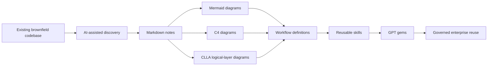
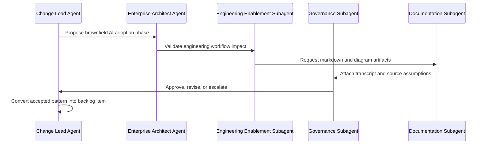
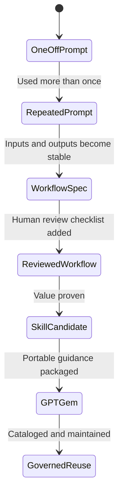
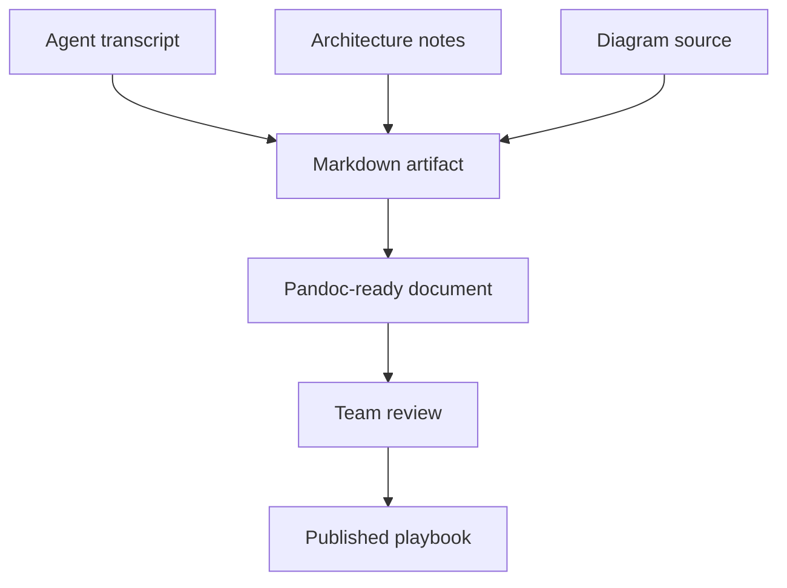

# AI Adoption Mermaid Diagrams

Source constraint: these diagrams are produced from `info.md` only.

## Brownfield Conversion Flow

## Agent Debate Flow

## Workflow-to-Skill Promotion

## Documentation Publishing Flow

