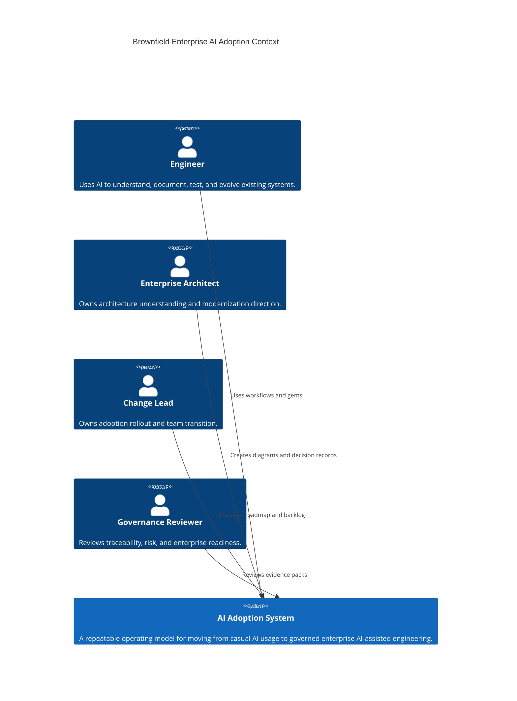
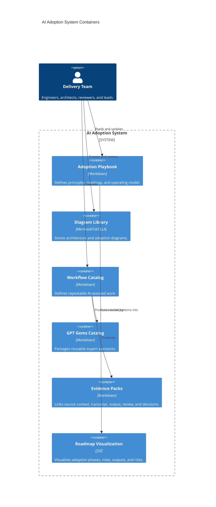
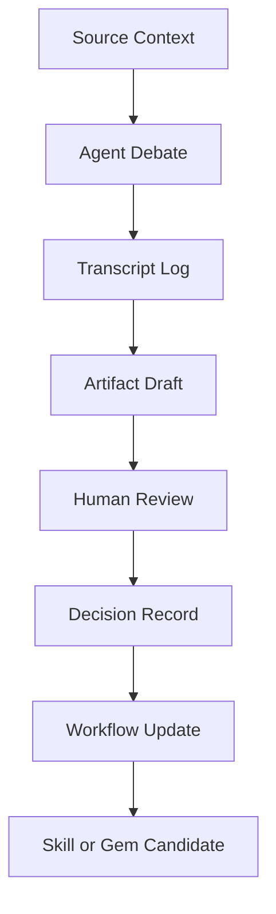

# C4 Model for Brownfield AI Adoption

Source constraint: this model is produced from `info.md` only.

This is a C4-style model for the AI adoption system itself. It does not claim details about any specific codebase internals.

## Level 1: System Context

## Level 2: Container View

## Level 3: Component View

## Level 4: Code View Placeholder

No code-level model is defined yet. The code-level view should be generated only after inspecting a real brownfield codebase and should remain grounded in observed files and runtime behavior.

