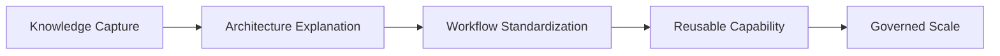

# CLLA Model for Brownfield AI Adoption

Source constraint: this model is produced from `info.md` only.

CLLA is interpreted here as Capability, Logical, Layer, and Actor views. This gives teams a compact way to reason about enterprise AI adoption before deep implementation details are available.

## Capability View

| Capability | Description | Output |
| --- | --- | --- |
| Brownfield Discovery | Understand existing code, docs, workflows, and risks | Markdown notes |
| Architecture Visualization | Create Mermaid, C4, and logical-layer diagrams | Diagram library |
| Agent Debate | Use agents and subagents to test options | Transcript logs |
| Workflow Conversion | Turn repeated prompts into repeatable processes | Workflow specs |
| Skill Promotion | Convert mature workflows into reusable skills | Skill candidates |
| GPT Gem Packaging | Package trusted guidance into reusable assistants | GPT gem catalog |
| Governance Review | Ensure traceability, risk review, and human approval | Evidence packs |
| Publishing | Convert markdown to shareable artifacts through Pandoc | Published docs |

## Logical View

## Layer View

| Layer | Responsibility |
| --- | --- |
| Source Layer | Existing codebase, current documentation, team knowledge |
| Understanding Layer | Markdown notes, diagrams, assumptions, decision records |
| Workflow Layer | Repeatable AI-assisted engineering processes |
| Skill Layer | Standardized skills derived from mature workflows |
| Gem Layer | Portable GPT assistants and guidance packs |
| Governance Layer | Transcript logs, evidence packs, reviews, risk register |

## Actor View

| Actor | Responsibility |
| --- | --- |
| Engineer | Uses workflows to understand, document, test, and evolve systems |
| Enterprise Architect | Owns architecture views and modernization strategy |
| Engineering Enablement | Converts practices into reusable skills and training |
| Change Lead | Manages adoption phases and backlog |
| Governance Subagent | Reviews risk, traceability, and human approval |
| Documentation Subagent | Maintains markdown, diagrams, and publishing readiness |

