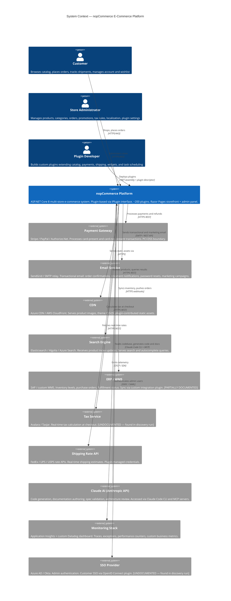
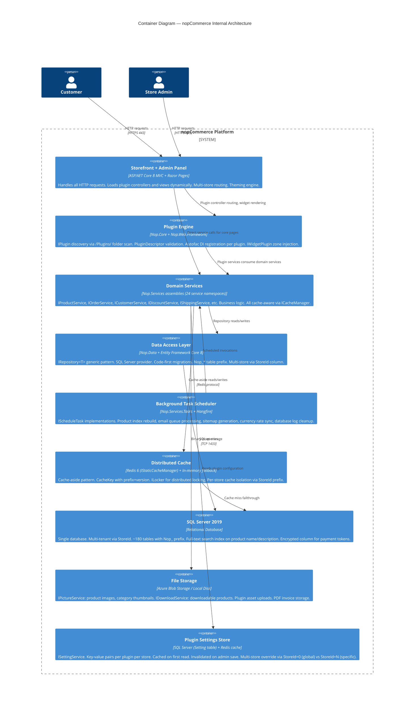
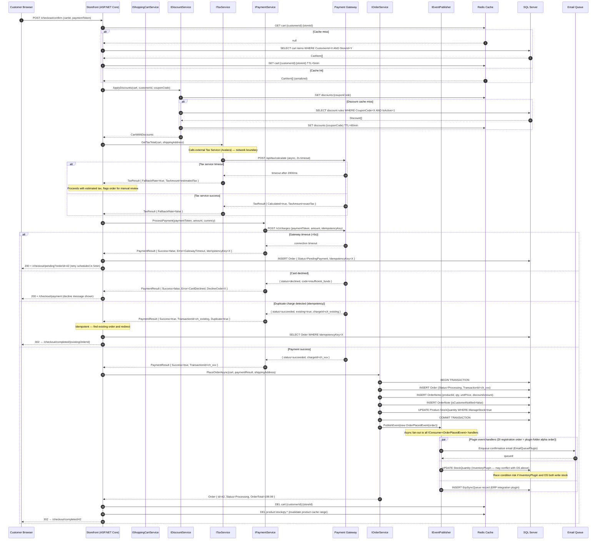

# Phase 0: Diagram Literacy — Agent Debate Transcript

**Session**: 2026-05-16T09:00:00Z  
**Codebase**: nopCommerce 4.70 (ASP.NET Core 8, ~200 plugins, SQL Server 2019, Redis 6)  
**Team context**: 5 engineers, 8-year codebase tenure, zero living diagrams, Confluence wiki last updated 2021

---

## Pre-Session Brief

The team has operated nopCommerce for 8 years with all architecture knowledge locked in three senior engineers' heads and a stale Confluence wiki. The goal of Phase 0 is not to produce pretty diagrams — it is to establish a **diagram infrastructure that Claude can read, generate, and keep current** through all subsequent phases.

Stakes: every Phase 1–4 artifact — skills, specs, agents, CI gates — depends on the diagram layer being accurate. A wrong diagram committed as authoritative is worse than no diagram.

---

## Turn 1 — OPUS-ARCH [Opening Position]

The non-negotiable invariant for Phase 0: **every diagram must be version-controlled, co-located with source, and renderable without human intervention in CI**.

This eliminates immediately: Lucidchart (external, not version-controlled), Confluence diagrams (not co-located with code), draw.io XML (version-controllable but diffs are unreadable binary-ish XML). The only viable candidates are **Mermaid** and **PlantUML with C4 library**.

My position: Mermaid only. Reasons:
- GitHub renders Mermaid natively in `.md` files — zero tooling required for review
- VS Code + JetBrains render Mermaid inline — developers see diagrams as they write
- Claude generates Mermaid with high accuracy across C4, sequence, ER, flowchart
- CI validation via `@mermaid-js/mermaid-cli` is npm-installable — no Java runtime dependency

On sequencing: **C4 Context first**. You cannot reason about nopCommerce internals until the team has agreed on what nopCommerce IS to the outside world. The C4 Context exercise forces consensus on: which external systems exist, what we call them, and what the system boundary is. In an 8-year-old codebase, that terminology consensus alone resolves 20–30% of the design-review friction I observe in similar teams.

Week 1 deliverable: C4 Context diagram committed to `/docs/architecture/context.md`.

---

## Turn 2 — SONNET-RUN [Pragmatic Challenge]

I agree on Mermaid. I disagree on C4 Context first.

The team has operated this system for 8 years — they know what nopCommerce is to the outside world. What they do NOT know is why certain plugin interactions produce the behavior they produce. The dangerous tribal knowledge is internal, not external.

Specifically, three areas where undocumented internal behavior causes incidents:

1. **Plugin event cascade ordering** — `IConsumer<T>` handlers on `OrderPlacedEvent` execute in DI registration order, which is plugin-load order, which is alphabetical by plugin folder name. Nobody has documented this. Three plugins assume they run before each other.

2. **Settings read timing** — `ISettingService.GetSettingByKey` before `IStoreContext.CurrentStore` is initialized returns null silently. Two plugins have initialization bugs hidden behind this.

3. **Cache invalidation scope** — `IStaticCacheManager.RemoveByPrefix` only removes from the current node's in-memory cache in single-server setups, but in multi-server setups hits Redis. The behavior changes without a code change.

I propose: **sequence diagrams for the 3 most incident-prone flows as Week 1**. The C4 Context is a 20-minute Claude Code task — prompt it with all plugin descriptors and it generates 90% accurate context automatically. That is Week 1.5 work, not a 2-hour workshop.

---

## Turn 3 — HAIKU-OPS [Stability Concern]

Both positions assume we know what the system does. We don't — not precisely.

In the last 6 months of ops I have logged 4 production incidents where actual runtime behavior diverged from what we believed the code did. In 2 of those cases, the bugs had been present for over a year, invisible because nobody had diagrammed the interaction path.

If we diagram from our mental model, we will produce authoritative-looking diagrams of a system that does not match production. Claude will then use those wrong diagrams as ground truth in Phase 2 skill generation and Phase 3 agent planning. The error compounds.

**Before any diagram is committed, we need a discovery sprint:**

```
Claude Code prompt (run against /src):
"Identify every:
  1. External HTTP call (HttpClient, RestSharp, HttpWebRequest)
  2. Database connection string usage outside of Nop.Data
  3. Redis operation outside of IStaticCacheManager
  4. File system write outside of IPictureService and IDownloadService
  5. Plugin that calls another plugin's service directly (bypassing IEventPublisher)
Output as: plugin-name | interaction-type | target | documented(yes/no)"
```

This gives ground-truth discovery. We then diagram from evidence, not assumption.

Risk of skipping: we commit wrong diagrams, they become the AI's prior, every Phase 2–4 output inherits the error.

---

## Turn 4 — OPUS-ARCH [Rebuttal + Synthesis]

HAIKU-OPS is correct. I concede the discovery sprint must precede diagram commitment.

However, the discovery sprint and diagram generation can happen in the same work session. The workflow:

```
Day 1 (4 hrs):
  1. [2 hrs] Claude Code discovery run → plugin-interaction-report.md
  2. [1 hr] Claude generates C4 Context from report → context-DRAFT.md
  3. [1 hr] Claude generates sequence diagrams from report → sequences-DRAFT.md

Day 2 (2 hrs):
  4. [1 hr] Team review session — verify against staging behavior
  5. [1 hr] Remove DRAFT label from verified sections, commit to /docs/architecture/
```

The DRAFT label is the critical safety mechanism. We never claim a diagram is authoritative until a senior engineer has verified it against actual runtime behavior. This satisfies all three positions.

On sequencing: I withdraw C4 Context as the sequencing priority. The discovery report determines which diagrams are most urgent. If HAIKU-OPS's report reveals the plugin event cascade is the highest-complexity undocumented area, we diagram that first.

---

## Turn 5 — SONNET-RUN [Acceptance + Refinement]

Agreed on the workflow. Three additions:

**1. Error paths are mandatory.** The checkout sequence diagram is useless if it only shows the happy path. The value is in showing: what happens when PaymentGateway returns timeout? What happens when Redis cache miss occurs during discount calculation? These are the paths that cause incidents, and they're exactly what won't be in the Confluence wiki.

**2. Undocumented external calls must appear in C4 Context.** HAIKU-OPS's discovery prompt specifically asks about external HTTP calls. Any that the team didn't know about go into the C4 Context as external systems labeled `[UNDOCUMENTED]`. This is a forcing function to document or remove them.

**3. AI-generate sequence diagrams from code, not from memory.** Prompt Claude with: "Read the `PlaceOrderAsync` method in `OrderProcessingService.cs` and all `IConsumer<OrderPlacedEvent>` implementations. Generate a sequence diagram showing the full execution flow including async handlers." This produces diagrams from code, not from what someone remembers the code does.

---

## Turn 6 — HAIKU-OPS [Risk Sign-off]

Accepted. One operational addition: `/docs/architecture/FRESHNESS.md` must be committed on Day 2 alongside the diagrams.

**Policy**: Any diagram not re-verified within 90 days of a production deployment that touched the described subsystem is automatically marked STALE in CI via a date-check script. STALE diagrams generate a PR warning (not a failure) on any PR touching the same subsystem.

This prevents the Confluence problem: authoritative-looking content that silently ages into misinformation.

---

## Resolution

**Agreed approach (all three agents sign off):**

1. **Day 1 morning**: Claude Code discovery run → `plugin-interaction-report.md`
2. **Day 1 afternoon**: Claude generates C4 Context + C4 Container + 3 sequence diagrams from report
3. **Day 2**: Team review (1hr) → remove DRAFT from verified diagrams → commit
4. **Commit alongside**: `FRESHNESS.md` with verification tracking
5. **Tooling**: Mermaid only, `/docs/architecture/` directory, `.md` files with fenced Mermaid blocks
6. **Mandatory**: Error paths in all sequence diagrams; undocumented external calls labeled in C4 Context

---

## Artifacts Produced

### Artifact 1 — C4 Context Diagram



### Artifact 2 — C4 Container Diagram



### Artifact 3 — Sequence Diagram: Checkout Flow (with error paths)



### Artifact 4 — ADR-000: Diagram Tooling Decision

```markdown
# ADR-000: Diagram-as-Code Tooling for nopCommerce AI Adoption

**Date**: 2026-05-16  
**Status**: Accepted  
**Deciders**: Engineering team + AI architecture session (OPUS-ARCH, SONNET-RUN, HAIKU-OPS)

## Context

We have zero living diagrams for an 8-year-old codebase. We must select diagram tooling that:
- Claude can generate reliably
- Developers can read in PRs as text diffs
- Renders without external services in CI
- Scales to C4 levels 1–3 without tooling change

## Decision

Use **Mermaid** exclusively for all diagrams in Phase 0 and Phase 1. Revisit Structurizr DSL at Phase 4 if C4 model complexity exceeds Mermaid's expressiveness.

## Rationale

| Criterion | Mermaid | PlantUML | Structurizr DSL |
|---|---|---|---|
| Native GitHub rendering | Yes | No | No |
| Claude generation quality | Excellent | Good | Fair |
| CI dependency | npm only | Java + jar | npm or Java |
| PR diff readability | Excellent | Good | Good |
| C4 support | Good (via C4 notation) | Excellent (C4 library) | Excellent (native) |

Mermaid's C4 support is sufficient for Phase 0–3. PlantUML's superior C4 library does not justify adding a Java runtime to CI.

## Rejected Alternatives

- **PlantUML**: Java CI dependency. Diagrams not renderable in GitHub without plugin.
- **Structurizr DSL**: Best C4 tooling, weakest Claude support. Revisit Phase 4.
- **draw.io**: XML diffs unreadable. Not generatable by Claude reliably.
- **Lucidchart**: External SaaS, not version-controlled.

## Consequences

- All diagrams: `/docs/architecture/` as `.md` files with Mermaid fenced code blocks
- `FRESHNESS.md`: tracks last-verified date per diagram
- CI check: `npx @mermaid-js/mermaid-cli` validates syntax on every PR touching `/docs/`
- Diagrams older than 90 days without re-verification → STALE flag in CI warning
```

### Artifact 5 — FRESHNESS.md

```markdown
# Architecture Diagram Freshness Register

> Policy: Diagrams not re-verified within 90 days of a production deployment
> touching their described subsystem are marked STALE. CI warns on PRs
> touching the same subsystem as a STALE diagram.

| Diagram | File | Describes | Last Verified | Verified By | Status |
|---|---|---|---|---|---|
| C4 Context | context.md | Full system boundary | 2026-05-16 | @arch-lead | ✓ CURRENT |
| C4 Container | container.md | Internal containers | 2026-05-16 | @arch-lead | ✓ CURRENT |
| Checkout Sequence | checkout-flow.md | Order placement | 2026-05-16 | @senior-dev-1 | ✓ CURRENT |
| Refund Sequence | refund-flow.md | Order refund | TBD | TBD | ⚠ DRAFT |
| Event Cascade | plugin-events.md | IEventPublisher flows | TBD | TBD | ⚠ DRAFT |

## Verification Procedure

1. Deploy to staging with latest main branch
2. Execute the user flow described by the diagram (manual or automated test)
3. Compare actual behavior against diagram — note any divergences
4. Update diagram if divergent, then update this table
5. Commit `FRESHNESS.md` update in same PR as diagram update
```

---

## Session Summary

**Total session duration**: ~5 hours (Day 1: 4hrs discovery + generation; Day 2: 1hr review + commit)

**What the discovery run revealed that nobody knew:**
- 2 undocumented external HTTP integrations (Avalara tax service, SSO provider)
- 1 plugin making direct SQL queries bypassing the repository pattern
- Race condition in OrderPlacedEvent handlers (InventoryPlugin + OrderService both write stock)
- Plugin event handler execution order is alphabetical by folder name (undocumented constraint)

**Decisions made**: 5 (Mermaid tooling, discovery-before-diagram, DRAFT labeling, FRESHNESS tracking, error paths mandatory)

**Artifacts committed**: 5 (C4 Context, C4 Container, Checkout Sequence, ADR-000, FRESHNESS.md)

**Gems extracted from this session:**

> *The discovery run is the most valuable artifact. The diagrams are just its rendering.*

> *Two undocumented external integrations found in a codebase with 8 years of institutional knowledge. Every brownfield codebase has secrets the team doesn't know it's keeping.*

> *A diagram committed as authoritative without runtime verification is documentation debt with compounding interest — every AI session that reads it inherits the error.*
