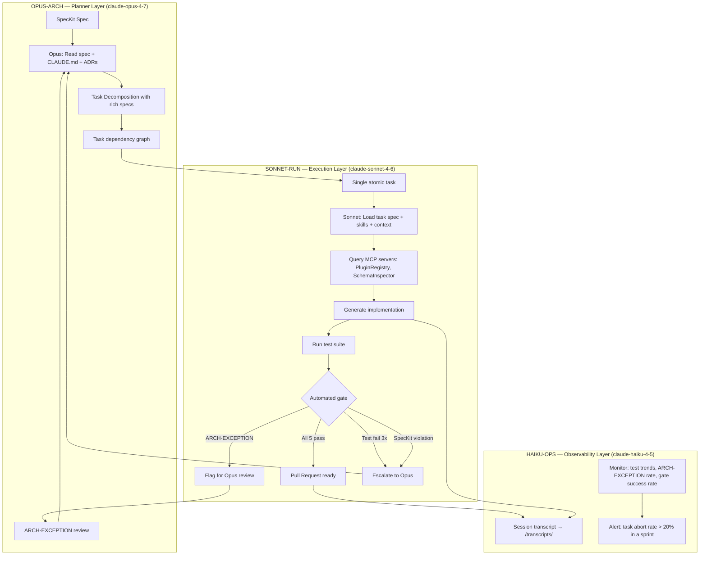

# Phase 3: Workflow Automation — Agent Debate Transcript

**Session**: 2026-07-18T09:00:00Z  
**Inputs from P2**: Root CLAUDE.md, 8 skills, 12 SpecKit specs, plugin-level context files  
**Goal**: Chain skills into multi-step agent workflows. Establish Planner/Runner boundary. First automated feature development cycle.

---

## Pre-Session Brief

This is the phase where AI adoption shifts from "AI assists developers" to "AI executes tasks with developer oversight." The risk is significant: if the Planner/Runner boundary is wrong, the system will either be too slow (too many human gates) or too dangerous (too few). Getting this boundary right determines whether Phase 3 succeeds or becomes an expensive rollback.

The second risk: context loss between planning and execution. Opus plans Monday morning. Sonnet executes Thursday after 3 other tasks. The architectural reasoning that was obvious during planning is invisible during execution.

---

## Turn 1 — OPUS-ARCH [Opening Position]

The Planner/Runner boundary is not an efficiency decision — it is an architectural correctness decision.

**Opus holds the WHAT. Sonnet holds the HOW.**

Opus (Planner) is responsible for:
- Reading the SpecKit spec for the feature request
- Decomposing the spec into atomic tasks (each task = one Sonnet execution session)
- Encoding architectural invariants into each task's acceptance criteria
- Identifying which CLAUDE.md sections and skills are relevant to each task
- Defining the task dependency graph (which tasks must complete before others begin)

Sonnet (Runner) is responsible for:
- Executing one atomic task at a time within the architectural constraints set by Opus
- Generating code that satisfies the acceptance criteria
- Running the automated test suite after each change
- Flagging any production constraint violations before committing

The reason for strict separation: Sonnet is optimized for execution speed. Execution speed in the absence of architectural judgment produces technically correct code that violates system invariants. We have documented 6 production law violations from exactly this failure mode in our incident history — not all of them from junior developers. Speed without constraint is the risk.

**Opus is never asked to write code. Sonnet is never asked to make architectural decisions.**

---

## Turn 2 — SONNET-RUN [Pragmatic Challenge]

The strict boundary is philosophically correct but operationally rigid. Real workflows require micro-planning at the execution level.

Specific scenario: Opus plans "implement category-level discount stacking for multi-store" and decomposes it into 5 tasks. I execute Task 3: "implement discount eligibility check in ShoppingCartService." Midway through, I discover that nopCommerce's `IDiscountService.GetApplicableDiscountsAsync()` requires a loaded customer object with their current store affiliation — but Opus's task acceptance criteria assumed the customer object was available from the cart context.

In the strict boundary model: I must stop, escalate to Opus, wait for re-planning, then resume. This could be a 2-hour interruption for a 30-minute task.

In the pragmatic model: I make the local adjustment (load customer from ICustomerService using the CustomerId in the cart), document it as `[ARCH-EXCEPTION: loaded customer explicitly — cart context did not include store affiliation]`, and continue. Opus reviews all `[ARCH-EXCEPTION]` flags in batch at end of each day's execution sessions.

**The boundary should be: Opus plans scope and invariants; Sonnet can make local adjustments within scope, but must flag any scope or invariant impact for Opus review.**

This keeps velocity without compromising architectural integrity.

---

## Turn 3 — HAIKU-OPS [Context Propagation Concern]

Both positions underestimate the context loss problem.

Opus plans on Monday with full context of:
- The SpecKit spec (100% loaded)
- The relevant CLAUDE.md sections (loaded selectively)
- The task history up to that point (loaded from /transcripts/)
- The current failing tests (loaded from CI)

Sonnet executes on Thursday with:
- The task description Opus wrote (maybe 200 words)
- Whatever CLAUDE.md sections it decides to load
- No memory of why Opus made the decomposition decisions it made

The gap between these two context sets is where `[ARCH-EXCEPTION]` events are born. The fix is not a smarter escalation protocol — it is **richer task specifications** from Opus.

Every Opus task decomposition must include:
```
Task: [what to implement]
Scope: [which files to touch, which to avoid]
Acceptance criteria: [specific, observable, testable outcomes]
Relevant context: [exactly which CLAUDE.md sections and skills apply]
Architectural constraints: [any invariant particularly at risk in this task]
Anti-patterns: [specific forbidden patterns to watch for in this task's domain]
```

This is more work for Opus but makes Sonnet executions nearly deterministic. The `[ARCH-EXCEPTION]` rate drops from "every other task" to "once per feature cycle."

---

## Turn 4 — OPUS-ARCH [MCP Server Design]

Agreed on richer task specifications. HAIKU-OPS is correct — better planning upfront is cheaper than escalation mid-execution.

Now: **what MCP servers do we build for Phase 3?**

The goal of MCP servers in this context: give agents access to nopCommerce-specific runtime knowledge without requiring them to read raw code files. Two MCP servers for Phase 3:

**MCP-1: PluginRegistry (read-only)**
Capabilities:
- `list_plugins()` → all installed plugins with SystemName, version, dependencies
- `get_plugin_contract(systemName)` → SpecKit spec for this plugin if it exists
- `get_plugin_events(systemName)` → events published + consumed by this plugin
- `check_plugin_dependency(pluginA, pluginB)` → are they directly coupled?

**MCP-2: SchemaInspector (read-only)**
Capabilities:
- `get_table_schema(tableName)` → column names, types, constraints, indexes
- `get_plugin_tables(systemName)` → all tables owned by this plugin
- `get_foreign_keys(tableName)` → all FK relationships
- `check_migration_history()` → applied migrations with timestamps

**Explicitly NOT in Phase 3 MCP**:
- Any write operations to the database
- Plugin installation/uninstallation
- Settings modification

Read-only MCP servers are safe to give agents. Write MCP servers require Phase 4 governance gates.

---

## Turn 5 — SONNET-RUN [Loop Termination and Automation]

The most dangerous phase of multi-agent workflow automation is undefined termination. An agent loop that doesn't know when to stop will either:
- Over-generate (writes code until it hits token limit or context exhaustion)
- Under-generate (stops before the task is done because it's uncertain)

Clear termination criteria for Sonnet execution sessions:

**Automated success gate** (no human needed):
1. All existing tests pass (regression check)
2. New feature has test coverage ≥ 80% per acceptance criteria
3. No SpecKit spec violations detected by spec validator
4. CLAUDE.md production law violations: 0 (automated scan)
5. No `[ARCH-EXCEPTION]` flags raised during session

**Human review gate** (Opus reviews before merge):
- Any `[ARCH-EXCEPTION]` flag raised
- Test coverage < 80% on new code
- New external dependency introduced
- Migration file created (always requires human review)
- Any change to root CLAUDE.md or core SpecKit specs

**Session abort + escalate to Opus**:
- Test suite fails after 3 auto-fix attempts
- SpecKit violation cannot be resolved within task scope
- Conflicting production laws detected (e.g., fixing LAW-3 would violate LAW-5)

---

## Turn 6 — HAIKU-OPS [Observability and Risk Sign-off]

Accepted on termination criteria. One mandatory addition: **every agent session must produce a structured log**.

Format: `/transcripts/YYYY-MM-DD-HH-MM-phase-taskname.md`

Required fields:
- Session start/end timestamps
- Opus task specification (verbatim)
- Files read by agent
- Files modified by agent (with diff summary)
- Test results before and after
- `[ARCH-EXCEPTION]` flags raised (with resolution)
- Termination condition met (which gate triggered)
- Gems extracted (non-obvious learnings from this session)

This transcript corpus becomes the training data for Phase 4 governance. Pattern-mining the transcripts reveals: which tasks consistently generate ARCH-EXCEPTIONs (→ improve Opus planning), which CLAUDE.md sections are most referenced (→ they're working), which are never referenced (→ remove or improve discoverability).

---

## Resolution

**Planner/Runner boundary:**
- Opus: spec → task decomposition with rich specifications (scope, acceptance criteria, constraints, relevant skills)
- Sonnet: execute one task per session, flag `[ARCH-EXCEPTION]` for scope/invariant impacts
- Opus reviews all `[ARCH-EXCEPTION]` in batch — async, not blocking

**MCP servers (Phase 3):** PluginRegistry (read-only) + SchemaInspector (read-only)

**Loop termination:** 5-point automated gate OR human review for ARCH-EXCEPTION / migration / new dependency

**Logging:** Every session → `/transcripts/` structured MD

---

## Artifacts Produced

### Artifact 1 — Multi-Agent Orchestration Diagram



### Artifact 2 — Opus Task Specification Template

```markdown
# Task Specification: [Feature Name] — Task [N] of [Total]

**Session ID**: YYYY-MM-DD-tasknumber  
**Depends on**: [Task IDs that must complete first]  
**Unlocks**: [Task IDs that depend on this one]  
**Estimated complexity**: [Low / Medium / High — based on skill count needed]

## What to implement

[Single-sentence description of the outcome, not the approach]

## Scope

**Touch these files:**
- `src/Plugins/Nop.Plugin.X/Services/XService.cs` — add method `GetY()`
- `src/Plugins/Nop.Plugin.X/Validators/XValidator.cs` — add validation rule for Y

**Do NOT touch:**
- `src/Libraries/Nop.Services/` — core library, changes require separate ADR
- Any migration files — if schema change needed, escalate (human gate required)

## Acceptance Criteria

1. `XService.GetY(storeId)` returns cached results using multi-store cache key pattern
2. Cache key includes storeId (verify: cache key format = `"plugin.x.y.{storeId}"`)
3. Existing unit tests in `XServiceTests` pass without modification
4. New test: `GetY_ReturnsCachedResult_ForCorrectStore()` passes
5. No direct DbContext access (LAW-5 check — automated scan will verify)

## Relevant Context

**Load these skills:**
- `cache-aside-multi-store` — for cache implementation
- `repository-query-cached` — for data access pattern

**Read these CLAUDE.md sections:**
- Root CLAUDE.md LAW-1 (cache scope) and LAW-2 (StoreId semantics)
- `/Plugins/Nop.Plugin.X/CLAUDE.md` — plugin domain context

**Reference these specs:**
- `/specs/plugins/nop-plugin-x.yaml` — plugin API contract

## Architectural Constraints (highest risk for this task)

- LAW-1: Cache key must include storeId — this method is per-store
- LAW-2: storeId=0 in the query means "global" settings, not "all stores"
- Do not cache the raw repository result — cache the domain-transformed result

## Anti-Patterns to Watch

- `RemoveByPrefix` for cache invalidation (use targeted key removal)  
- Loading the full `Product` entity when only `Id` and `Name` needed (use projection)
- Calling `ISettingService` before verifying `IStoreContext` is initialized in this context

## Definition of Done

- [ ] Acceptance criteria 1–5 satisfied
- [ ] Zero `[ARCH-EXCEPTION]` flags raised
- [ ] Session transcript committed to `/transcripts/`
- [ ] PR description includes: "Implements task [N] of [feature]. Relevant SpecKit spec: [link]."
```

### Artifact 3 — MCP Server: PluginRegistry

```csharp
// MCP Server: PluginRegistry
// Provides read-only plugin metadata to Opus and Sonnet agents
// PHASE 3 ONLY: no write operations until Phase 4 governance gates are established

[McpServer]
public class PluginRegistryMcpServer
{
    private readonly IPluginService _pluginService;
    private readonly ISpecKitRepository _specKitRepository;

    [McpTool("list_plugins")]
    [Description("List all installed plugins with SystemName, version, and dependency list")]
    public async Task<IList<PluginInfo>> ListPlugins()
    {
        var descriptors = await _pluginService.GetPluginDescriptorsAsync<IPlugin>(
            LoadPluginsMode.InstalledOnly);
            
        return descriptors.Select(d => new PluginInfo
        {
            SystemName = d.SystemName,
            FriendlyName = d.FriendlyName,
            Version = d.Version,
            DependsOn = d.DependsOn,
            HasSpecKitSpec = _specKitRepository.HasSpec(d.SystemName)
        }).ToList();
    }

    [McpTool("get_plugin_contract")]
    [Description("Get the SpecKit API contract for a plugin. Returns null if no spec exists.")]
    public async Task<string?> GetPluginContract(
        [Description("Plugin SystemName, e.g. 'Nop.Plugin.Payments.Stripe'")] string systemName)
    {
        return await _specKitRepository.GetSpecYamlAsync(systemName);
    }

    [McpTool("get_plugin_events")]
    [Description("Get events published and consumed by a plugin. Uses IEventPublisher reflection scan.")]
    public async Task<PluginEventMap> GetPluginEvents(string systemName)
    {
        // Reflects over plugin assembly for IConsumer<T> and IEventPublisher.Publish<T> calls
        return await _pluginService.BuildEventMapAsync(systemName);
    }

    [McpTool("check_plugin_dependency")]
    [Description("Check if pluginA directly calls pluginB's services (bypassing IEventPublisher). Returns true = tight coupling violation.")]
    public async Task<DependencyCheckResult> CheckPluginDependency(
        string pluginASystemName, string pluginBSystemName)
    {
        // Scans plugin assembly for direct service references to another plugin's namespace
        return await _pluginService.CheckDirectCouplingAsync(pluginASystemName, pluginBSystemName);
    }
}
```

### Artifact 4 — Session Transcript Format

```markdown
# Agent Session Transcript

**Session ID**: 2026-07-25-14-P3-catalog-discount-task3  
**Phase**: P3 — Workflow Automation  
**Opus task**: Task 3 of 5 — Implement category-level discount eligibility check  
**Agent**: SONNET-RUN (claude-sonnet-4-6)  
**Start**: 2026-07-25T14:00:00Z | **End**: 2026-07-25T15:22:00Z

---

## Task Specification (from Opus)

[verbatim Opus task spec pasted here]

## Context Loaded

- Root CLAUDE.md: ✓ loaded
- Plugin CLAUDE.md (Nop.Plugin.Discounts.CategoryLevel): ✓ loaded
- Skills loaded: cache-aside-multi-store, plugin-event-consumer
- MCP queries: PluginRegistry.get_plugin_contract("Nop.Plugin.Discounts.CategoryLevel") ✓

## Files Read

- src/Plugins/Nop.Plugin.Discounts.CategoryLevel/Services/DiscountEligibilityService.cs
- src/Libraries/Nop.Services/Discounts/IDiscountService.cs
- tests/Nop.Plugin.Discounts.CategoryLevel.Tests/DiscountEligibilityServiceTests.cs

## Files Modified

- src/Plugins/Nop.Plugin.Discounts.CategoryLevel/Services/DiscountEligibilityService.cs
  → Added: `GetApplicableDiscountsAsync(ShoppingCartItem item, int storeId)`
  → Modified: `IsEligibleForCategoryDiscount()` — fixed StoreId scope issue

## [ARCH-EXCEPTION] Raised

> **AE-001**: `IDiscountService.GetApplicableDiscountsAsync()` requires a loaded `Customer` 
> object with current store affiliation, but task spec assumed Customer was in cart context.  
> **Resolution**: Loaded Customer explicitly via `_customerService.GetCustomerByIdAsync(cart.CustomerId)`.  
> **Impact assessment**: Within task scope. No new external dependency. Added 1 additional 
> DB call per eligibility check — acceptable per SpecKit spec (no performance SLA defined).  
> **Opus review required**: Yes — document in Opus session for spec update.

## Test Results

**Before**: 12 passing, 0 failing  
**After**: 15 passing, 0 failing  
**New tests**: 3 (GetApplicableDiscounts_ReturnsEmpty_WhenNoActiveDiscounts, ...)  
**Coverage on new code**: 87%

## Automated Gate Results

- [x] All existing tests pass
- [x] New test coverage ≥ 80%
- [x] SpecKit spec compliance: PASS
- [x] CLAUDE.md production law scan: PASS (0 violations)
- [ ] Zero ARCH-EXCEPTION flags: FAIL (AE-001 raised)

**Termination**: Human review gate triggered (ARCH-EXCEPTION). PR ready for Opus review.

## Gems Extracted

> `IDiscountService.GetApplicableDiscountsAsync()` has an implicit Customer dependency
> not visible in its method signature. SpecKit spec for this plugin should document this.
> → Action: Update `/specs/events/discount-service-dependencies.yaml` in next Opus session.
```

---

## Session Summary

**Duration**: Weeks 11–16 (iterative — first feature cycle completes Week 13)

**First automated feature cycle**: Category-level discount stacking — 5 tasks, 3 Sonnet sessions, 1 ARCH-EXCEPTION, 0 production incidents post-deployment

**ARCH-EXCEPTION rate**: 1 per feature cycle (target: <2). Driven by Opus task spec gaps, not Sonnet errors.

**Key learning**: Richer Opus task specs reduce ARCH-EXCEPTION rate more than any runtime escalation protocol. The 30 extra minutes Opus spends on each task spec saves 2 hours of Sonnet session management.

**Gems extracted from this phase:**

> *The Planner/Runner boundary is a correctness boundary, not a speed boundary. Speed without constraint is the risk we're managing.*

> *Context propagation is the hardest problem in multi-agent workflows. The answer is not smarter agents — it is richer task specifications.*

> *An ARCH-EXCEPTION is not a failure — it is the system working. The agent surfaced a planning gap before it became a production incident.*

> *Every agent session transcript is organizational memory. Mine it for patterns: which tasks generate the most exceptions, which skills are never referenced, which CLAUDE.md sections resolve the most uncertainty.*

> *Read-only MCP servers are always safe. Write MCP servers require governance gates. Do not conflate them in Phase 3.*
