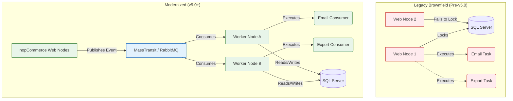

# Design Doc: Distributed Job Processing Architecture

**System:** nopCommerce Core
**Updated:** 2026-05-22

## 1. Overview
This document outlines the modernized background job processing architecture for nopCommerce. To support cloud-native deployments, we have decoupled background execution from the main web process using an Event-Driven Architecture (EDA) powered by MassTransit.

## 2. Architectural Blueprint

Below is the high-level architecture comparing the Legacy pattern with the Modernized pattern.



## 3. Core Components

### 3.1 `INopMessageBus` (The Abstraction)
We do not expose MassTransit directly to plugin developers. Instead, we provide `INopMessageBus`. This prevents tight coupling to a specific message broker framework.

```csharp
public interface INopMessageBus
{
    Task PublishAsync<T>(T message) where T : class;
}
```

### 3.2 The Deployment Topologies
Because nopCommerce supports everyone from small merchants to enterprise clusters, the architecture is polymorphic based on the `appsettings.json`:

1.  **Monolithic Mode (Default):**
    *   `"MessageBus": "InMemory"`
    *   Both Web and Worker run inside the same .NET process. No external RabbitMQ needed. Zero infrastructure changes for small users.
2.  **Distributed Mode (Enterprise):**
    *   `"MessageBus": "RabbitMQ"`
    *   Web nodes act as *Publishers*.
    *   Separate Docker containers run the *Worker* host.

## 4. The Bridging Strategy (Dealing with Legacy)
To prevent breaking 500+ existing plugins, we utilize an **Adapter Pattern**. 
The old `IScheduleTask` engine still exists, but instead of executing the task, it publishes a `LegacyTaskTriggeredEvent`. A generic MassTransit consumer picks this up and invokes the legacy code. This provides safety while logging a warning that the plugin is using deprecated APIs.

## 5. Observability
All MassTransit consumers are hooked into OpenTelemetry. Traces will flow from the HTTP Request (where the event was published) directly to the Worker node (where it was consumed), allowing full visibility in systems like Jaeger or Application Insights.
